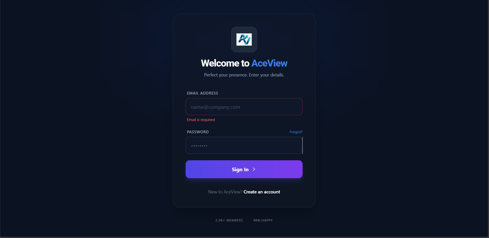
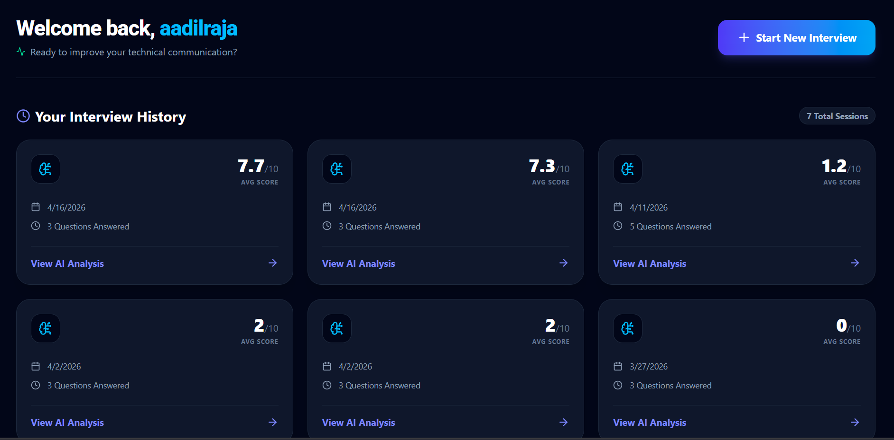
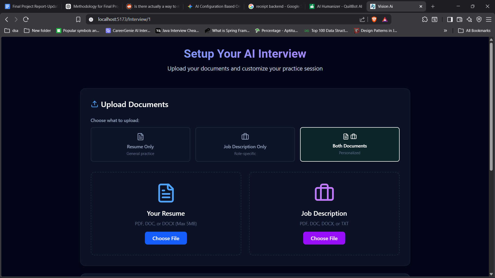
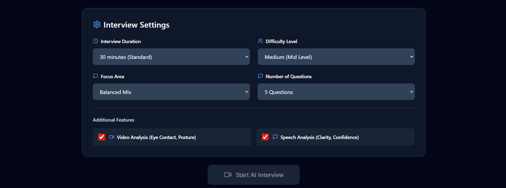
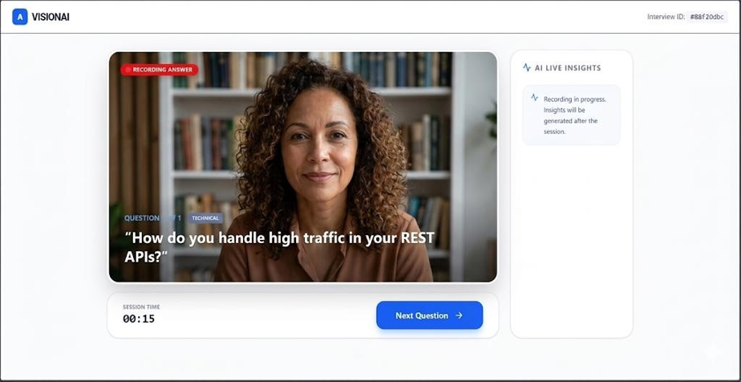

# Mock AI Interviewer

> An AI-powered mock interview platform that generates personalized interview questions and evaluates candidate responses using speech-to-text, computer vision, facial emotion analysis, and a local LLM.

1. Login Page


2. Dashboard


3. File Upload


4. Interview Settings


5. Live Interview



## Overview

**Mock AI Interviewer** is a full-stack AI interview practice platform designed to simulate technical and behavioral interviews.

Candidates can provide their **resume and/or job description**, configure the interview difficulty and focus area, and answer questions through a webcam-based interview interface.

Each recorded response is processed through multiple analysis stages:

- Speech-to-text transcription using **Whisper**
- Face detection using **OpenCV**
- Facial emotion analysis using **DeepFace**
- Answer evaluation using **Ollama / Llama 3.2**
- Concept coverage analysis
- AI-generated strengths and improvement suggestions

The results are stored and presented through a dashboard so candidates can review their interview performance.

---

## Key Features

### Personalized Interview Generation

Generate interview questions based on:

- Resume
- Job description
- Interview difficulty
- Interview focus
- Number of questions

Questions are generated dynamically using a locally hosted **Llama 3.2 model through Ollama**.

### Configurable Interviews

Candidates can configure:

- Difficulty level
- Interview focus
- Number of questions
- Interview duration
- Resume / job-description context
- Speech analysis
- Video analysis

### Webcam-Based Interview

The browser uses the camera and microphone to record each candidate response.

Each answer is captured as a video and uploaded to the backend for processing.

### Speech-to-Text

The audio track is extracted from the recorded video and transcribed using **OpenAI Whisper**.

The resulting transcript becomes the primary input for AI-based answer evaluation.

### Computer Vision Analysis

The recorded video is processed using **OpenCV**.

The current implementation detects whether the candidate's face is visible in sampled frames and calculates a camera-presence percentage.

> This is a face-presence metric, not true eye tracking or gaze estimation.

### Facial Emotion Analysis

**DeepFace** is used to analyze sampled video frames and identify detected facial emotions.

The dominant detected emotion is presented as an additional behavioral indicator.

### AI Answer Evaluation

The local LLM evaluates each response and generates structured feedback including:

- Overall score
- Expected concepts
- Concepts covered
- Missing concepts
- Strengths
- Areas for improvement
- Feedback on the response

### Interview History

Completed interviews are stored in the database.

The dashboard allows candidates to review previous interview sessions and their results.

---

## Architecture

```text
                         ┌──────────────────────┐
                         │      Candidate       │
                         │                      │
                         │ Resume / Job Desc.   │
                         │ Interview Settings   │
                         └──────────┬───────────┘
                                    │
                                    ▼
                         ┌──────────────────────┐
                         │     React Frontend   │
                         │                      │
                         │ Interview Setup      │
                         │ Webcam + Microphone  │
                         │ Results Dashboard    │
                         └──────────┬───────────┘
                                    │
                                    ▼
                         ┌──────────────────────┐
                         │      Flask API       │
                         │                      │
                         │ Session Management   │
                         │ File Processing      │
                         │ Interview Services  │
                         └───────┬───────┬──────┘
                                 │       │
                    ┌────────────┘       └────────────┐
                    ▼                                 ▼
          ┌──────────────────┐              ┌──────────────────┐
          │ Question         │              │ Answer           │
          │ Generation       │              │ Processing       │
          └────────┬─────────┘              └────────┬─────────┘
                   │                                 │
                   ▼                         ┌───────┴────────┐
          ┌──────────────────┐                │                │
          │ Ollama           │                ▼                ▼
          │ Llama 3.2        │          ┌──────────┐    ┌────────────┐
          │                  │          │ Whisper  │    │ OpenCV +   │
          │ Generate        │          │   STT    │    │ DeepFace   │
          │ Questions       │          └────┬─────┘    └─────┬──────┘
          └──────────────────┘               │                │
                                             │                │
                                             ▼                ▼
                                        Transcript      Vision Metrics
                                             │                │
                                             └───────┬────────┘
                                                     ▼
                                            ┌─────────────────┐
                                            │ Ollama / Llama  │
                                            │ Answer          │
                                            │ Evaluation      │
                                            └────────┬────────┘
                                                     │
                                                     ▼
                                            ┌─────────────────┐
                                            │ SQLite Database  │
                                            │                 │
                                            │ Sessions        │
                                            │ Answers         │
                                            │ Scores          │
                                            │ Feedback        │
                                            └────────┬────────┘
                                                     │
                                                     ▼
                                            ┌─────────────────┐
                                            │ Results /       │
                                            │ Dashboard       │
                                            └─────────────────┘
```

---

## AI & Analysis Pipeline

The interesting part of the system is the processing pipeline for each interview answer.

```text
Recorded WebM Video
        │
        ├───────────────────────┐
        │                       │
        ▼                       ▼
   Audio Track              Video Frames
        │                       │
        ▼                       ├──► OpenCV
     Whisper                   │       │
        │                      │       └──► Face Presence
        ▼                      │
   Transcript                 └──► DeepFace
        │                              │
        │                              └──► Emotion
        │
        └──────────────┬───────────────┘
                       ▼
                 Ollama / Llama
                       │
                       ├──► Score
                       ├──► Concepts Covered
                       ├──► Missing Concepts
                       ├──► Strengths
                       └──► Improvements
                       │
                       ▼
                  Stored Results
```

This allows the application to evaluate both:

> **What the candidate says**

and

> **How the candidate presents themselves on camera**

---

## AI Question Generation

The interview setup accepts optional candidate context:

```text
Resume
   +
Job Description
   +
Difficulty
   +
Focus Area
   +
Number of Questions
        │
        ▼
  Dynamic Prompt
        │
        ▼
 Ollama / Llama 3.2
        │
        ▼
 Structured Questions
```

The generated questions are stored as part of an interview session so that the interview can retrieve and evaluate the corresponding questions and answers.

---

## Answer Evaluation

For each answer, the system extracts the transcript and sends the question/answer context to the local LLM.

The evaluation produces structured information such as:

```text
Question
   │
   └── Candidate Transcript
           │
           ▼
       Llama 3.2
           │
           ├── Overall Score
           ├── Expected Concepts
           ├── Covered Concepts
           ├── Missing Concepts
           ├── Strengths
           └── Improvements
```

This makes the evaluation more useful than simply returning a numerical score.

---

## Computer Vision

### Face Presence

OpenCV's Haar Cascade face detector is used on sampled video frames.

The implementation calculates the percentage of sampled frames in which a face is detected.

```text
Face Presence =
Frames with detected face
────────────────────────── × 100
Total sampled frames
```

This provides an approximation of how consistently the candidate remains visible/camera-facing during their response.

It should **not** be interpreted as precise eye tracking.

### Emotion Detection

DeepFace analyzes sampled frames and produces facial emotion predictions.

The application identifies the dominant detected emotion across the analyzed frames.

This is treated as a behavioral indicator rather than a definitive measurement of the candidate's actual emotional state.

---

## Tech Stack

### Frontend

- React
- React Router
- Axios
- React Hook Form
- Lucide React
- Browser MediaDevices API
- Browser MediaRecorder API

### Backend

- Python
- Flask
- Flask-CORS
- Flask-SQLAlchemy
- SQLAlchemy
- Werkzeug

### AI / ML

- Ollama
- Llama 3.2 3B
- OpenAI Whisper
- DeepFace
- OpenCV

### Document Processing

- pdfplumber
- python-docx

### Media Processing

- MoviePy
- WebM
- WAV

### Database

- SQLite
- SQLAlchemy

---

## Project Structure

```text
MockAiInterviewer/
│
├── api/
│   ├── AnalysisService.py
│   ├── auth_service.py
│   ├── config.py
│   ├── database.py
│   ├── dashboard_service.py
│   ├── HealthService.py
│   ├── InterviewService.py
│   ├── interviewSetup.py
│   ├── models.py
│   ├── routes.py
│   └── run.py
│
├── ui/
│   └── src/
│       ├── assets/
│       ├── Component/
│       ├── pages/
│       │   ├── Hero.jsx
│       │   ├── Login.jsx
│       │   ├── RegisterationForm.jsx
│       │   ├── InterViewSetupPage.jsx
│       │   ├── InterviewPage.jsx
│       │   ├── ResultPage.jsx
│       │   └── UserDashBoard.jsx
│       │
│       ├── Styles/
│       ├── App.jsx
│       └── main.jsx
│
├── LICENSE
└── README.md
```

---

## Backend Services

The backend is organized into separate services for authentication, interview management, analysis, and dashboard functionality.

| File | Responsibility |
|---|---|
| `auth_service.py` | User registration and authentication |
| `interviewSetup.py` | Resume/JD processing and question generation |
| `InterviewService.py` | Interview answer upload and processing |
| `AnalysisService.py` | Whisper, OpenCV, DeepFace and Ollama analysis |
| `dashboard_service.py` | Interview history and dashboard data |
| `models.py` | Database models |
| `routes.py` | API routes |
| `HealthService.py` | Backend health checks |
| `config.py` | Application configuration |
| `run.py` | Flask application entry point |

---

## Interview Flow

### 1. User Authentication

A candidate creates an account or logs in.

### 2. Interview Configuration

The candidate selects the interview parameters and optionally uploads:

- Resume
- Job description

### 3. Question Generation

The backend extracts text from the uploaded documents and provides the information to the local LLM.

The generated questions are stored as an interview session.

### 4. Interview

The candidate answers questions using their webcam and microphone.

Each response is recorded individually.

### 5. Answer Processing

The recorded video is uploaded to the backend.

The backend:

1. Extracts the audio.
2. Transcribes the audio with Whisper.
3. Analyzes video frames with OpenCV.
4. Runs facial emotion analysis with DeepFace.
5. Sends the question and transcript to Ollama.
6. Stores the generated evaluation.

### 6. Results

The candidate can review:

- Score
- Transcript
- Concepts covered
- Missing concepts
- Strengths
- Improvements
- Face-presence percentage
- Dominant detected emotion

Previous interviews are also available through the dashboard.

---

## API

The backend exposes endpoints for authentication, interview management, answer processing, results, and health checks.

### Authentication

```http
POST /api/auth/register
POST /api/auth/login
```

### User

```http
GET /api/users/<userId>
```

### Interview

```http
POST /api/interview/generate-questions

GET /api/interview/session/<session_id>

POST /api/interview/upload-answer

GET /api/interview/results/<session_id>

GET /api/interview/history/<user_id>

GET /api/interview/ollama-health
```

### Health

```http
GET /api/health
```

---

## Running Locally

### Prerequisites

Install:

- Python 3.x
- Node.js
- npm
- Ollama
- FFmpeg

A webcam and microphone are required for the interview functionality.

### 1. Clone the repository

```bash
git clone https://github.com/aadilraja/MockAiInterviewer.git
cd MockAiInterviewer
```

### 2. Start Ollama

Install Ollama and pull the model used by the application:

```bash
ollama pull llama3.2:3b
```

Make sure Ollama is running before starting the backend.

### 3. Start the backend

```bash
cd api
python -m venv venv
```

Activate the virtual environment.

#### Windows

```bash
venv\Scripts\activate
```

#### macOS / Linux

```bash
source venv/bin/activate
```

Install the backend dependencies:

```bash
pip install flask flask-cors flask-sqlalchemy werkzeug ollama pdfplumber python-docx opencv-python openai-whisper deepface moviepy
```

Start the API:

```bash
python run.py
```

The backend runs on:

```text
http://localhost:8080
```

### 4. Start the frontend

In another terminal:

```bash
cd ui
npm install
npm run dev
```

The frontend communicates with the Flask backend running on port `8080`.

---

## Configuration

The application uses Ollama with the following configuration:

```python
OLLAMA_MODEL = "llama3.2:3b"
OLLAMA_TEMPERATURE = 0.7
OLLAMA_NUM_PREDICT = 1024
```

The default database is SQLite:

```text
sqlite:///users.db
```

The Flask application can also use a configured secret key:

```bash
SECRET_KEY=your_secret_key
```

Do not commit real secrets or credentials to the repository.

---

## What Makes This Project Interesting

The project goes beyond a traditional text-based mock interview application by building a complete **multimodal processing pipeline**.

Instead of evaluating only a transcript:

```text
Question → Text Answer → Score
```

the application processes a recorded response through multiple systems:

```text
                  Interview Answer
                         │
             ┌───────────┴───────────┐
             │                       │
           Audio                    Video
             │                       │
          Whisper                 OpenCV
             │                       │
        Transcript             Face Presence
             │                       │
             │                    DeepFace
             │                       │
             └───────────┬───────────┘
                         │
                    Local LLM
                         │
                         ▼
                 Structured Feedback
```

This required integrating:

- Browser media APIs
- File uploads
- Video/audio processing
- Speech recognition
- Computer vision
- Facial analysis
- Local LLM inference
- Structured AI responses
- Database persistence
- React/Flask communication

---

## Limitations

The current implementation has several limitations:

- Face detection is used as a proxy for camera presence rather than actual eye tracking.
- Emotion detection depends on camera quality, lighting, and face visibility.
- Video and AI processing can be computationally expensive.
- LLM-generated scores and feedback can vary.
- The application currently relies on a local Ollama model.
- Analysis is performed after the recorded response is uploaded rather than through continuous live video inference.
- The project does not currently perform true posture analysis.
- The project does not currently provide adaptive follow-up questions based on previous answers.

---

## Future Improvements

Potential improvements include:

- Real-time response analysis
- Adaptive follow-up questions
- Improved gaze/eye-contact estimation
- Posture and body-language analysis
- Speaking-speed analysis
- More comprehensive filler-word analysis
- Additional LLM providers
- PostgreSQL support
- Background processing for video analysis
- Dockerized deployment
- Automated testing
- Production-grade authentication and authorization
- Improved media storage and cleanup

---

## License

This project is licensed under the **Apache License 2.0**.

See [`LICENSE`](LICENSE) for details.

---

## Author

**Aadil Raja**

GitHub: [@aadilraja](https://github.com/aadilraja)
```
